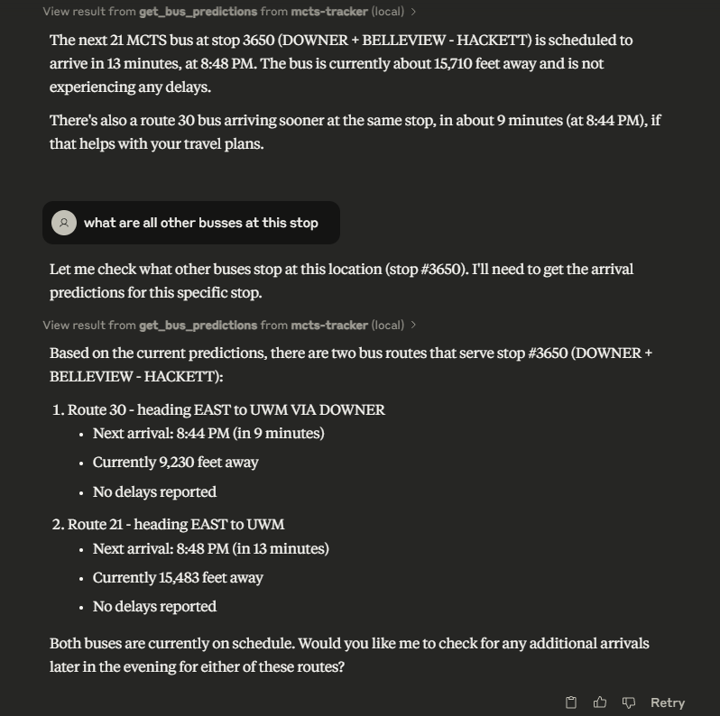

# MCTS Tracker MCP Server

[](https://www.python.org/downloads/release/python-3120/)
[](https://opensource.org/licenses/MIT)

A Model Context Protocol (MCP) server that provides real-time Milwaukee County Transit System (MCTS) bus information.

## What is MCP?

The [Model Context Protocol (MCP)](https://github.com/modelcontextprotocol/mcp) is an open standard that enables AI assistants to safely interact with external tools and data sources. This server implements the MCP specification to provide real-time transit information that can be accessed by compatible AI models like Claude, GPT, and others.

## Features

- 🚌 **Real-time Bus Predictions**: Get accurate arrival times for any MCTS bus stop
- 🔌 **MCP Compatibility**: Works with any MCP-compatible AI assistant
- 🔒 **Secure API Integration**: Properly handles authentication with the MCTS API
- 📊 **Formatted Responses**: Provides well-structured transit information

## Prerequisites

- Python 3.12 or higher
- MCTS API key (obtainable from [Milwaukee County Transit System developer portal](https://realtime.ridemcts.com/bustime/home.jsp))

## Installation

1. Clone the repository:
   ```bash
   git clone https://github.com/yourusername/mcts-mcp.git
   cd mcts-mcp
   ```

2. Set up a virtual environment (optional but recommended):
   ```bash
   python -m venv .venv
   # On Windows
   .\.venv\Scripts\activate
   # On macOS/Linux
   source .venv/bin/activate
   ```

3. Install dependencies:
   ```bash
   pip install -e .
   ```

4. Create a `.env` file in the project root with your MCTS API key:
   ```
   MCTS_API_KEY=your_api_key_here
   ```

## Usage

### Running the Server

To start the MCP server:

```bash
python mcts-tracker.py
```

By default, the server uses stdio transport. You can also specify other transport methods as documented in the [MCP Python SDK](https://github.com/modelcontextprotocol/python-sdk).

### Configure for AI Assistants

#### Claude/Cursor/VSCode Copilot

```json
  "mcts-tracker": {
              "command": "uv",
              "args": [
                  "--directory",
                  "\\path\\to\\mcts-mcp",
                  "run",
                  "mcts-tracker.py"
              ],
              "env": {
          "MCTS_API_KEY": "your_api_key_here"
        }
          }
```

### Available Tools

#### get_bus_predictions

Returns real-time bus arrival predictions for a specific stop ID.

**Parameters:**
- `stop_id` (string, required): The ID of the bus stop in Milwaukee.
- `query` (string, optional): Additional query context from the user.

**Example Response:**
```
Stop Name: WISCONSIN + WATER
Stop ID: 4599
Vehicle ID: 5902
Route: 30 (30X)
Direction: EAST
Destination: WISCONSIN & JACKSON
Predicted Arrival Time: 20230515 13:45
Countdown: 5 minutes
Delay: No
Distance to Stop: 5280 feet
Timestamp: 20230515 13:40
Trip ID: 1234
Block ID: 30-1
Type: A
Dynamic: Yes
```

## Server Architecture

```
mcts-mcp/
├── mcts-tracker.py        # Main MCP server entry point
├── pyproject.toml         # Project dependencies and metadata
├── .env                   # API key configuration (not committed to repository)
└── src/
    ├── api/               # API client for MCTS interactions
    │   ├── __init__.py
    │   └── mcts_client.py # MCTS API client implementation
    └── tools/             # MCP tool implementations
        ├── __init__.py
        └── predictions.py # Bus predictions implementation
```

The server follows a modular architecture:
- `mcts-tracker.py` initializes the FastMCP server and registers tool functions
- `src/api/mcts_client.py` handles communication with the MCTS API
- `src/tools/predictions.py` contains tool implementation and response formatting logic

## Examples

### Sample Usage Output

Below is an example of how the MCTS MCP server is used in Claude to fetch real-time bus predictions:




### Demo Video

Watch how the MCTS MCP server integrates with Claude:

<div>
    <a href="https://www.loom.com/share/8d189201556d4865beac8bd0d716bf2a">
      <p>Claude - 4 April 2025 - Watch Video</p>
    </a>
    <a href="https://www.loom.com/share/8d189201556d4865beac8bd0d716bf2a">
      
    </a>
</div>

### AI Assistant Interaction

```
User: When is the next bus arriving at stop 4599?

AI: Let me check the real-time bus predictions for stop 4599.

*AI uses the get_bus_predictions tool with stop_id=4599*

Based on the real-time data, the next bus arriving at WISCONSIN + WATER (stop 4599) is:
- Route 30 (30X) heading EAST
- Arriving in 5 minutes
- Destination: WISCONSIN & JACKSON
- No delays reported
```

## Development

### Adding a New Tool

To add a new tool to the MCP server:

1. Define your tool implementation in the `src/tools` directory
2. Import the tool in `mcts-tracker.py` 
3. Register it using the `@mcp.tool()` decorator
4. Write proper docstrings with parameter documentation

Example:

```python
@mcp.tool()
async def get_route_info(route_id: str) -> str:
    """Get information about a specific bus route.

    Args:
        route_id: The ID of the bus route in Milwaukee.
    """
    # Implementation goes here
    return "Route information"
```

### Testing

Test your MCP server locally using the MCP CLI:

```bash
mcp execute mcts-tracker get_bus_predictions --params '{"stop_id": "4402"}'
```

This allows you to test tools without connecting an AI assistant.

### Environment Variables

Create a `.env` file in the root directory with these variables:

```
MCTS_API_KEY=your_api_key_here
```

## Documentation and Resources

- [Model Context Protocol Specification](https://github.com/modelcontextprotocol/mcp)
- [MCP Python SDK Documentation](https://github.com/modelcontextprotocol/python-sdk/blob/main/README.md)
- [MCTS API Documentation](https://www.ridemcts.com/developers) (requires registration)

## Contributing

Contributions are welcome! Here's how you can contribute:

1. Fork the repository
2. Create a feature branch: `git checkout -b feature/amazing-feature`
3. Commit your changes: `git commit -m 'Add amazing feature'`
4. Push to the branch: `git push origin feature/amazing-feature`
5. Open a pull request

Before contributing, please read the documentation-first development rule in our contributing guidelines.

## License

This project is licensed under the MIT License - see the LICENSE file for details.

## Acknowledgements

- Milwaukee County Transit System for providing the API
- Model Context Protocol team for their excellent tools and documentation
- All contributors to this project
